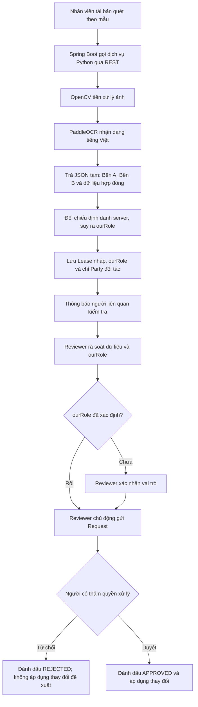

# Luồng OCR hợp đồng

## Mục tiêu và phạm vi

OCR hỗ trợ lập hồ sơ hợp đồng từ bản quét, giảm nhập liệu thủ công. Bản đầu xử lý tài liệu rõ nét theo một mẫu hợp đồng thống nhất; kết quả OCR và vai trò công ty mình được lưu ngay thành bản nháp. Người liên quan nhận thông báo, kiểm tra/chỉnh sửa bản nháp, rồi tự gửi Request khi đã sẵn sàng.

## Tác nhân

- Nhân viên lập hồ sơ: tải tài liệu và khởi tạo bản nháp.
- Người kiểm tra được thông báo: rà soát/chỉnh sửa bản nháp, chủ động gửi Request sau khi kiểm tra xong.
- Người có thẩm quyền: duyệt hoặc từ chối Request.
- Dịch vụ OCR Python: tiền xử lý ảnh bằng OpenCV và nhận dạng tiếng Việt bằng PaddleOCR.
- Backend Spring Boot: điều phối gọi OCR qua REST, lưu bản nháp, phát thông báo và kết nối luồng Request.
- MongoDB: lưu bản nháp ngay trong collection `leases` với `active = false`; sau khi Request được duyệt, áp dụng thay đổi theo quy trình nghiệp vụ.
- Cấu hình định danh doanh nghiệp trên server/secret manager: dùng để đối chiếu một định danh ổn định; không lưu giá trị cấu hình trong JSON OCR hoặc tài liệu repo.

## Luồng chính đã chốt

1. Nhân viên tải bản quét hợp đồng theo mẫu đã chọn.
2. Backend chuyển tài liệu tới dịch vụ Python qua REST API.
3. Dịch vụ Python dùng OpenCV tiền xử lý ảnh, sau đó PaddleOCR nhận dạng ký tự tiếng Việt.
4. Dịch vụ trả dữ liệu JSON có cấu trúc, gồm thông tin Bên A, Bên B và các nhóm nghiệp vụ: Lease, Party/Contact, LeaseSuite, LeaseAmenity, Clause, Amendment, LeaseOption và RecurringCost. Thông tin hai bên dùng trong bước xử lý OCR/đối chiếu; không mặc định lưu cả hai bên thành Party.
5. Backend dùng định danh server đã cấu hình để xác định `ourRole`. Khi xác định được vai trò, chỉ tạo/liên kết Party của phía đối tác vào `Lease.partyId`; không tạo hoặc lưu Party cho công ty mình. Backend lưu Lease nháp trong collection `leases` với `active = false`. Nếu vai trò chưa xác định, lưu trạng thái `UNRESOLVED` và tham chiếu tài liệu gốc để reviewer đối chiếu; không ghi snapshot dữ liệu Party của hai bên vào collection `parties`.
6. Hệ thống thông báo cho người liên quan rằng bản nháp cần được kiểm tra.
7. Người được thông báo kiểm tra dữ liệu Lease và Party đối tác; đối chiếu Bên A/B trên tài liệu gốc khi cần. Nếu `ourRole = UNRESOLVED`, reviewer xác nhận bên nào là công ty mình, hệ thống gán Party phía đối diện vào `Lease.partyId`, rồi reviewer xác nhận dữ liệu trước khi gửi Request.
8. Khi hoàn tất, reviewer tự bấm gửi Request; người có thẩm quyền duyệt hoặc từ chối.
9. Chỉ khi Request được duyệt, backend mới áp dụng dữ liệu vào Lease và các collection liên quan theo luồng nghiệp vụ hiện có. Request bị từ chối không áp dụng thay đổi đề xuất.

## Dữ liệu và quy tắc

- Đầu vào thuộc phạm vi bản đầu: bản quét rõ nét theo một mẫu thống nhất.
- Đầu ra OCR: bản trích xuất Bên A/B được dùng tạm thời để đối chiếu; dữ liệu hai bên không được lưu nguyên trạng vào bản nháp. Bản nháp lưu `ourRole`, thông tin Lease và Party đối tác duy nhất cùng các nhóm dữ liệu liên quan. Thông tin công ty mình không tạo thành Party và không lưu thành snapshot Party; reviewer xem tài liệu gốc qua `docUrl` khi cần. `ourRole` chỉ được tự xác định bằng định danh ổn định từ cấu hình server.
- Thông báo sau lưu nháp: báo người liên quan cần kiểm tra; thông báo không tự tạo/gửi Request.
- Gửi Request: do người kiểm tra chủ động thực hiện sau khi rà soát xong.
- Đối tượng phê duyệt: Request dùng luồng hiện có; các trạng thái nghiệp vụ hiện có trong code là `PENDING`, `APPROVED`, `REJECTED`.
- Quy tắc cập nhật: OCR lưu bản nháp ngay; bản nháp không đồng nghĩa dữ liệu hợp đồng đã được phê duyệt. Chỉ áp dụng thay đổi theo Request sau khi duyệt.
- Quy tắc dashboard: bản nháp giữ `active = false`; dashboard chỉ nhận lease có `active = true` theo quyết định chủ dự án.
- Collection liên quan theo proposal: Lease, Party, Contact, LeaseSuite, LeaseAmenity, Clause, Amendment, LeaseOption, RecurringCost. Suite và Amenity là danh mục tham chiếu để phân giải `suiteId`/`amenityId`, không phải bản ghi do OCR tự tạo.
- Mẫu trường và phân biệt model hiện tại/schema mục tiêu: [JSON kiểm kê trường Lease và OCR](../ocr/office-lease-all-fields.template.json).

## Nhận diện vai trò công ty mình

- OCR trích rõ hai bên theo vai hợp đồng trong `partyA` và `partyB` trong bộ nhớ/xử lý tạm để đối chiếu. Chỉ lưu/liên kết Party đối tác trên `Lease.partyId`; không tạo Party hoặc lưu snapshot thông tin của công ty mình. Tài liệu hợp đồng gốc được giữ qua `docUrl` để reviewer kiểm tra.
- Backend đọc định danh công ty mình từ cấu hình môi trường server hoặc secret manager. Cấu hình chọn loại định danh (`TAX_CODE` hoặc `IDENTITY_DOCUMENT`) và giá trị tương ứng; ưu tiên mã số thuế, chỉ dùng giấy tờ định danh khi chủ thể là cá nhân và không có mã số thuế. Không ghi giá trị thật vào repository, JSON mẫu, log hoặc blockchain.
- Chuẩn hóa khoảng trắng, dấu phân cách và chữ hoa/thường rồi so khớp chính xác mã số thuế hoặc giấy tờ định danh đã chọn. Không dùng tên, địa chỉ, người đại diện hay tài khoản ngân hàng làm điều kiện tự động quyết định vai trò.
- Chỉ Bên A khớp → `ourRole = LANDLORD`; chỉ Bên B khớp → `ourRole = TENANT`. Không khớp, thiếu định danh, hoặc cả hai bên cùng khớp → `ourRole = UNRESOLVED`, cần reviewer xác nhận trước khi gửi Request.
- `ourRole` là vai trò của công ty mình trong hợp đồng, lưu ở Lease. `Lease.partyId` luôn trỏ tới duy nhất Party đối tác: mình là `LANDLORD` thì đối tác lấy từ Bên B; mình là `TENANT` thì đối tác lấy từ Bên A. Bỏ `Party.isLandlord` vì vai trò của một Party phụ thuộc từng hợp đồng. Thay `Lease.isLandlord` và `Lease.landlordTenant` bằng một `Lease.ourRole` để tránh trùng nguồn sự thật. Không lưu hai Party cho Bên A/B; thông tin công ty mình chỉ dùng để đối chiếu và không tạo bản ghi Party.
- Party hiện tại chưa có đầy đủ trường pháp lý; Lease hiện có `isLandlord` và `landlordTenant`, chưa có `ourRole`. Đây là schema mục tiêu; cần cập nhật model/API/UI và xử lý dữ liệu cũ trước khi bật phân loại tự động. Lease hiện chỉ có một `partyId`, phù hợp quyết định lưu một Party đối tác cho mỗi Lease; phải ghi rõ ngữ nghĩa đối tác trong API/UI và OCR mapping. OCR, kiểm tra vai trò và lưu nháp là luồng đích; repository hiện chưa có dịch vụ OCR.

## Quyết định dữ liệu còn thiếu

- Các trường pháp lý mở rộng trên Party và `Lease.ourRole` là schema mục tiêu, chưa có trong model Java hiện tại.
- Chưa có thông tin định danh công ty hoặc quyền truy cập môi trường server trong repository; cấu hình thật phải được thiết lập riêng ở server/secret manager.
- Khi `ourRole = UNRESOLVED`, reviewer phải đối chiếu tài liệu gốc, xác nhận bên nào là công ty mình rồi mới gán phía đối diện làm Party và gửi Request. Không lưu snapshot Party Bên A/B khi chưa xác định được phía đối tác.

## Ngoài phạm vi đã chốt

- Nhiều mẫu hợp đồng hoặc tài liệu quét bất kỳ.
- Tự động gửi Request ngay sau OCR hoặc thông báo.
- Tự động áp dụng đề xuất đã gửi mà chưa qua phê duyệt.
- Huấn luyện mô hình OCR riêng.

## Hiện trạng và tích hợp

Repository hiện có model `Lease` trong collection `leases` với trường `active` và Request flow. `Party` hiện chưa có mã số thuế, địa chỉ, người đại diện, giấy tờ định danh, tài khoản/ngân hàng; `Party.isLandlord` đang được UI sử dụng. `Lease` có `isLandlord`/`landlordTenant` nhưng chưa có `ourRole`. Chưa thấy dịch vụ Python OCR, thông báo kiểm tra hoặc giao diện OCR review. Cần bảo đảm draft endpoint lưu `active = false`, reviewer có cách mở draft, dashboard tiếp tục lọc `active = true`, và việc lưu draft không sửa lease active hiện hữu. Gửi Request phải là hành động tường minh của người kiểm tra; chỉ áp dụng thay đổi sau phê duyệt. Không suy diễn rằng endpoint CRUD trực tiếp hiện có đã tự được Request bảo vệ.
